# Blog app

### Python web application prepared to maintain blog website

## Table of contents

* [General info](#general-info)
* [Technologies](#technologies)
* [Screenshots](#screenshots)
* [Status](#status)

## General info

The app was created as my one of many individual projects prepared as self development project after 3 months Python Developer course at Coders Lab IT school. The main aim was to continue personal development as a Junior Python Developer.

The application allows:

- add posts [registration using email as username] (by customizing user model) - [link to screenshot](./img_readme/5_register_form.png), app verifies whether email is unique, new user is not active, after registration new user gets email message with unique link to activate user account (SMTP method via gmail) - [link to screenshot](./img_readme/10_registration_email_with_activation_link.png)

- new user [registration using email as username] (by customizing user model) - [link to screenshot](./img_readme/5_register_form.png), app verifies whether email is unique, new user is not active, after registration new user gets email message with unique link to activate user account (SMTP method via gmail) - [link to screenshot](./img_readme/10_registration_email_with_activation_link.png)
- counters of donations and number of supported institutions created with aggregate and annotate methods - [link to screenshot](./img_readme/2_aggregate_annotate.png)
- listing of registered institution by type (choice method): foundation and others, with details and pagination - [link to screenshot](./img_readme/3_pagination.png)
- a contact form that allows any guest to send e-mails to users with administrator status (SMTP method via gmail) - [link to screenshot](./img_readme/4_contact_form.png)
- login with email as username - [link to screenshot](./img_readme/6_login_form.png)
- users with admin status enable opportunity to get to admin module via link in user's settings directly in the website after login, thanks to customizing the delete method the last user with admin status can not be deleted - the request admin user get the proper error message - [link to screenshot](./img_readme/7_admin_panel_link.png)
- reset password via email message sent to request user - [link to screenshot](./img_readme/8_password_reset_form.png)
- custom password validation with related message visible for user after trying to set an improper password - [link to screenshot](./img_readme/9_custom_password_validation.png)
- submit JS multistep form with AJAX, jQuery and JsonResponse creating object in database calling related action - [link to screenshot](./img_readme/11_AJAX_JS_submit_action.png)
- rendering filtered records of requested model in multisteps JS form (enabling authorised user to determine supported institution) - [link to screenshot](./img_readme/12_multisteps_JS_form.png)
- determination of address and term of related logistic operation in multisteps JS form - [link to screenshot](./img_readme/13_multisteps_JS_form_inputs.png)
- summary on the basis of previous values filled in inputs determined in multisteps JS form using - using JS actions with: document.querySelector, addEventListener, createElement, appendChild - [link to screenshot](./img_readme/14_summary_Js_form.png)
- submit action defined in JS allowing request.POST to backend in Python (AJAX with jQuery) allows creation of new record in related model (table in database) and after JsonResponse redirects to the success view with confirmation and information about email confirmation with details of the transaction - [link to screenshot](./img_readme/15_confirmation_view.png)

and many others

## Technologies

* Bootstrap 4
* Python 3.8.3
* Django
* JavaScript (AJAX, jQuery, JSON)
* pytest-django, psycopq2-binary, pytz, django-taggit, Markdown,
* postgreSQL
* IDE (PyCharm)

The application bases on the database created in the postgres. The app was created in Django and JS with many different technics applied: [AJAX, jQuery and JsonRequest](./img_readme/11_AJAX_JS_submit_action.png) in practice [submit action via JavaScript to Django](./img_readme/14_summary_Js_form.png), [contact form with emailing to users with admin status (SMTP method)](./img_readme/4_contact_form.png), [custom user model](./img_readme/5_register_form.png) and [login by email not my username](./img_readme/6_login_form.png), activation user profile via personal [unique link send by email to a new user (SMTP method)](./img_readme/10_registration_email_with_activation_link.png), custom delete method preventing deletion of the last admin, set of functionalities as 'forgot your password', ['set new password'](./img_readme/8_password_reset_form.png) and following, [aggregate and annotate methods in practice](./img_readme/2_aggregate_annotate.png), creating forms, models and views (generic and straight classic views and generic forms with applied widgets), custom password unique validation methods.

## Screenshots

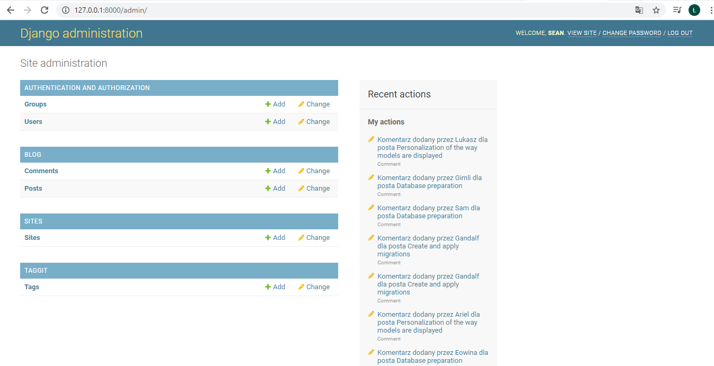
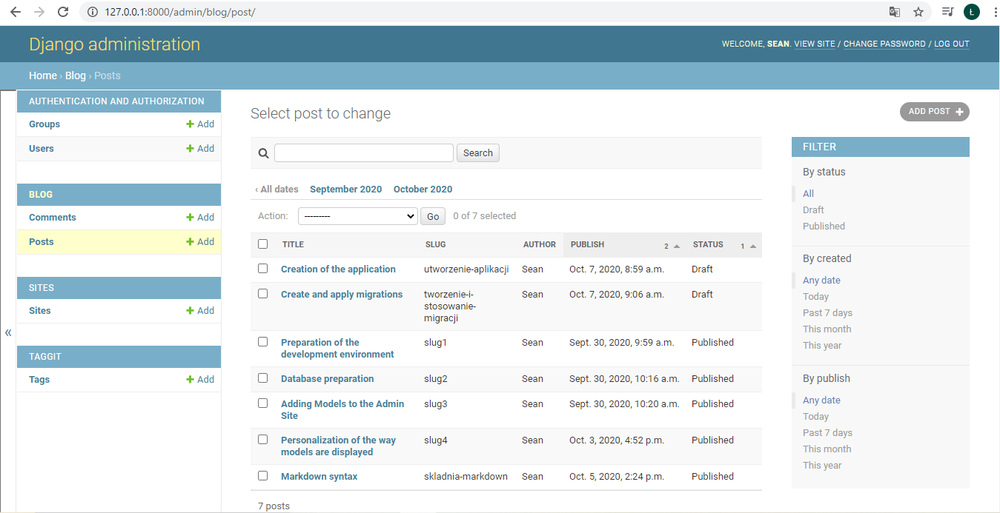
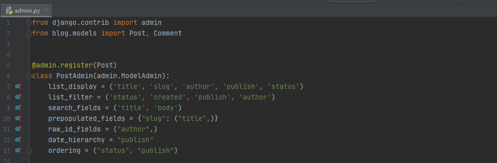
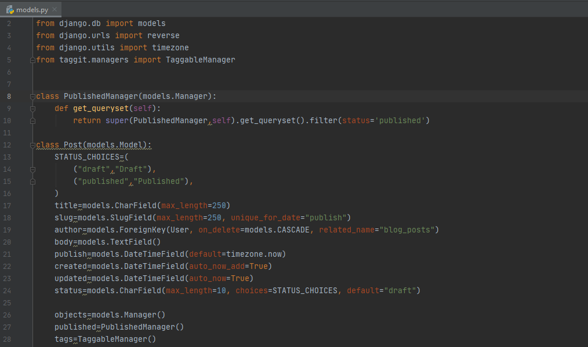
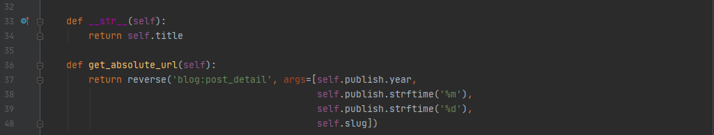
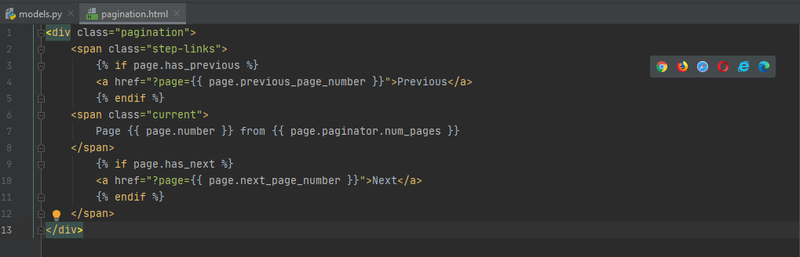
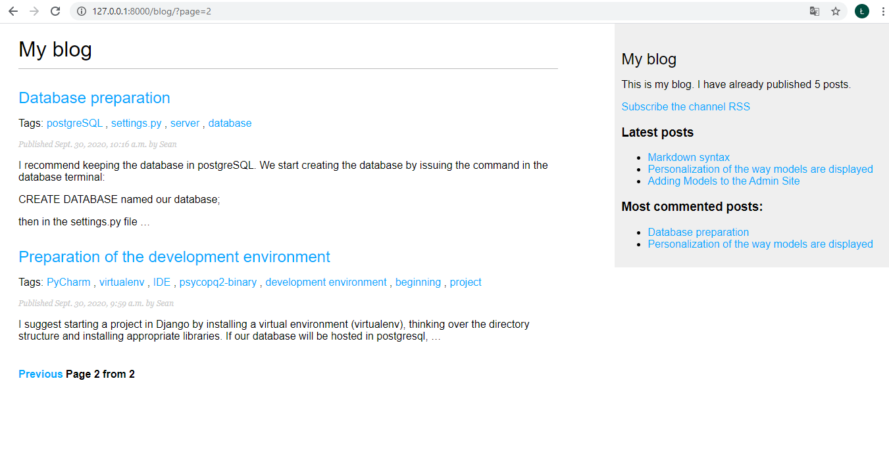
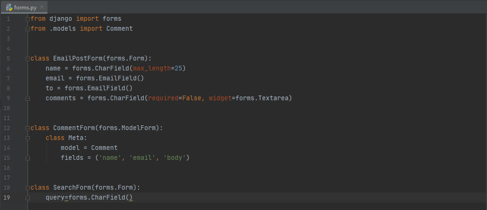
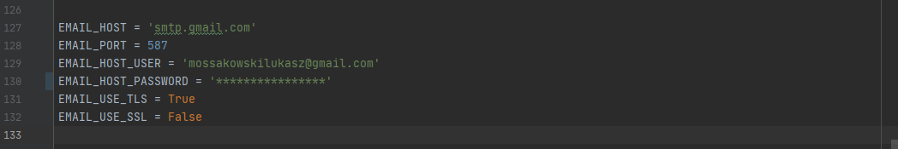
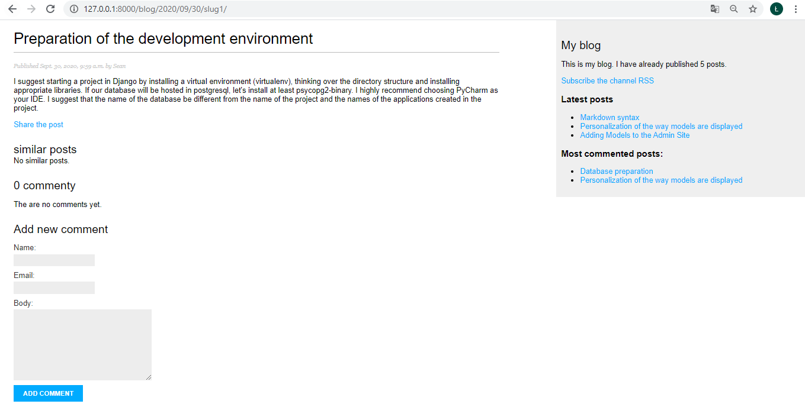
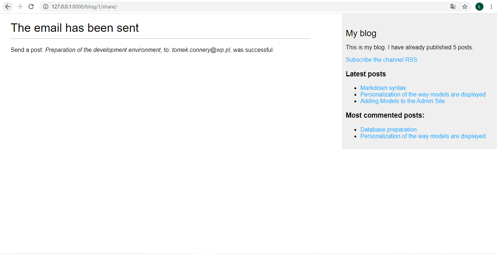
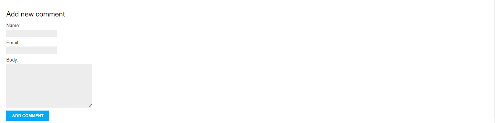

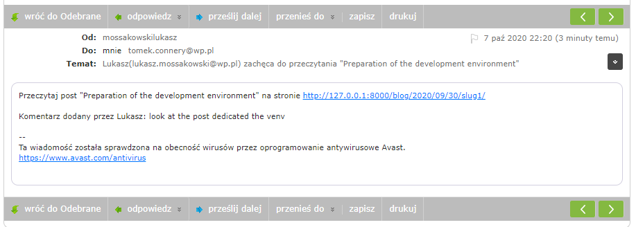

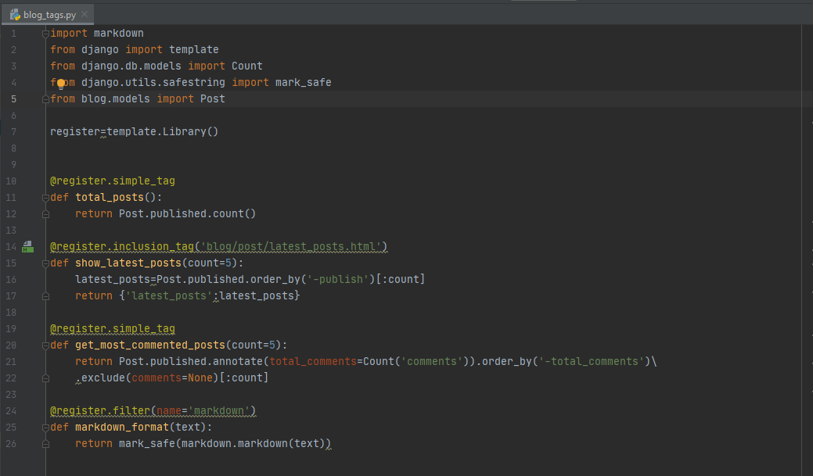
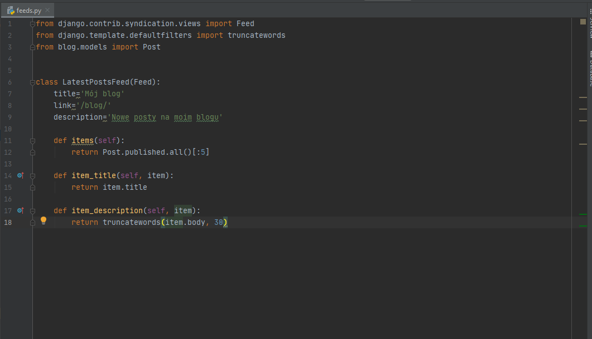
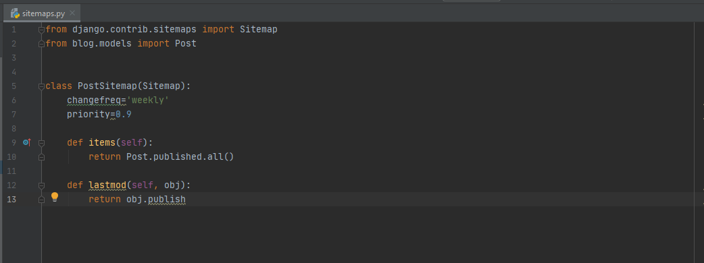
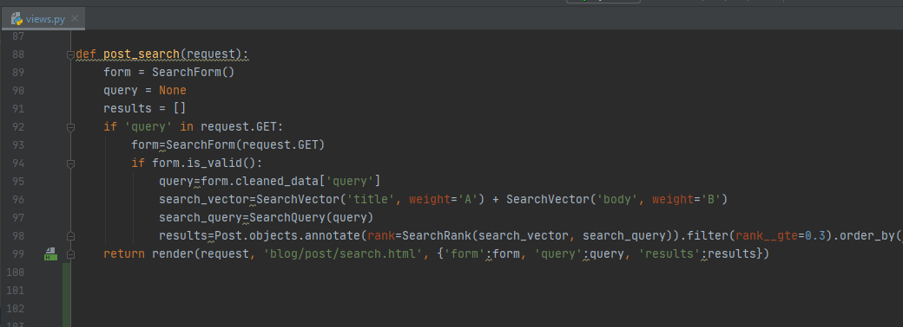
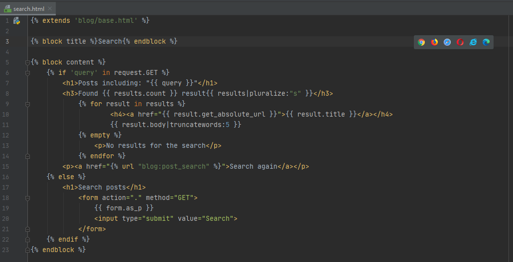
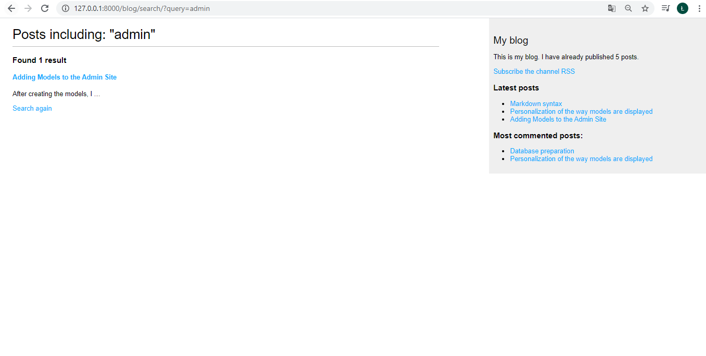
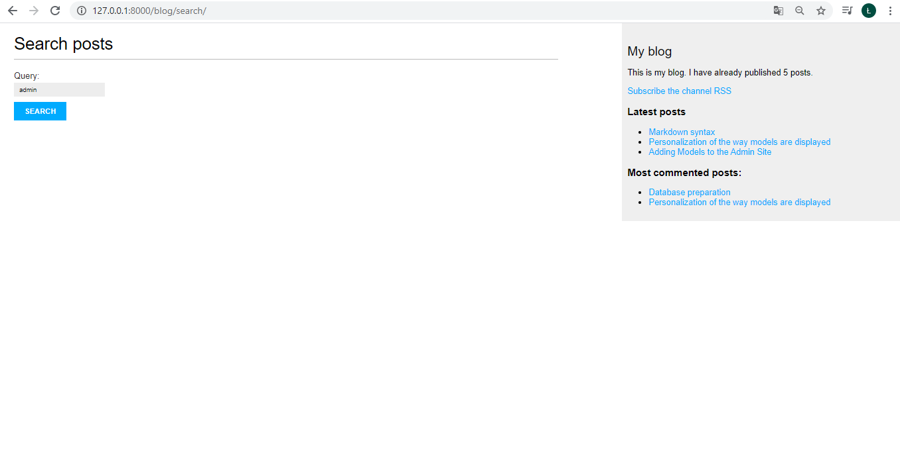

## Status

The project is finished.

