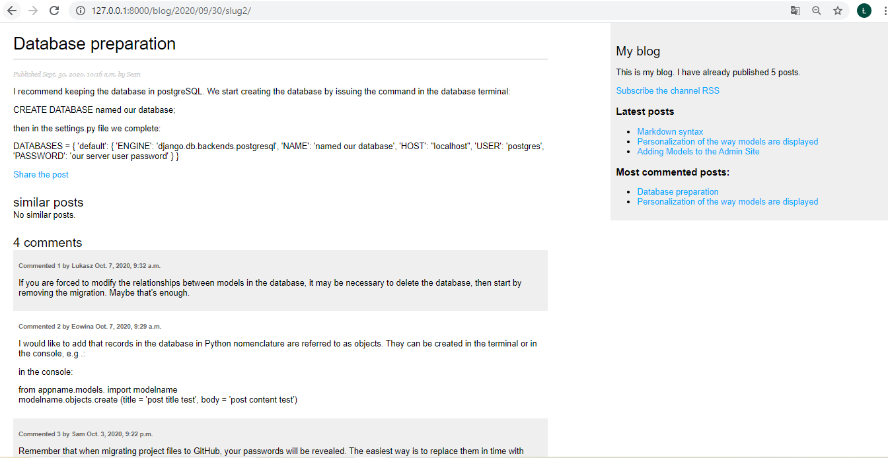
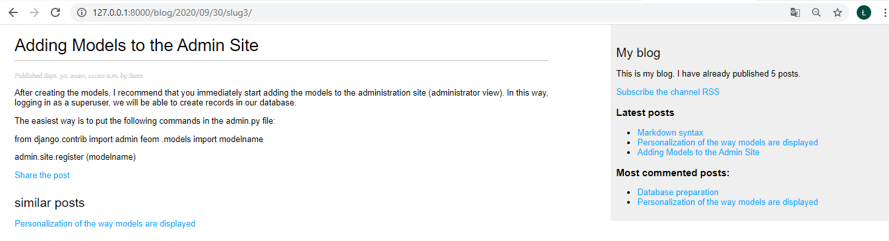

# Blog app

### Python web application prepared to provide and administrate the blog website

## Table of contents

* [General info](#general-info)
* [Technologies](#technologies)
* [Screenshots](#screenshots)
* [Status](#status)

## General info

The app was created as my one of many individual projects prepared as self development project after 3 months Python Developer course at Coders Lab IT school. The main aim was to continue personal development as a Junior Python Developer.

The application allows:

- add and present list of posts, tags and comments with information about date, time and author of publication, posts and comment are segregated from the most recent, comments are counted and the number of comments is presented over the comments at post detail template, also number of posts are counted and the number of published posts is presented in the separate column in the website as presented in the picture, posts which are listed are [filtered according to criterions as for instance: stutus, using custom model manager](./img_readme/4_custom_model_manager.png) and due to usage of [custom template tags](./img_readme/16_custom_template_tags.png) what enable the admin to [unactivate posts with unwanted content](./img_readme/2_admin_posts_view.png) - [link to screenshot](./img_readme/7_pagination.png)
- divide posts per pages (pagination) at the template with list of posts - [link to screenshot](./img_readme/6_pagination.png), [link to screenshot](./img_readme/7_pagination.png),
- view details of the post chosen by the user at the post list template - [link to screenshot](./img_readme/10_share_post_add_comment.png),
- share the chosen post by the guest with any addressee via email, the proper email message is send from admin email address to the defined addressee using SMTP method - [link to screenshot](./img_readme/23_share_template.png), in result the addressee get an email with the proper information as in the picture - [link to screenshot](./img_readme/14_email_with_confirmation.png)
- thanks to the use of tags, detail view of each post enable user to view similar posts - [link to screenshot](./img_readme/15_similar_posts.png)
- latest posts and most commented posts are presented in the separate column in the website as presented in the picture - [link to screenshot](./img_readme/15_similar_posts.png)
- the website is available for subscription - [link to screenshot](./img_readme/15_similar_posts.png)
- the website guest is available for searching posts using search form with search field which is available for search in two related columns of the model: title and body of the post, result are presented at the template with information about numbers of results with list of found posts and abbreviated body of the post (truncatewords) - [link to screenshot](./img_readme/21_search_results.png)

and others

## Technologies

* Bootstrap 4
* Python 3.8.3
* Django
* JavaScript (AJAX, jQuery, JSON)
* pytest-django, psycopq2-binary, pytz, django-taggit, Markdown,
* postgreSQL
* IDE (PyCharm)

The application bases on the database created in the postgreSQL. The app was created in Django, [contact form with emailing to users with admin status (SMTP method)](./img_readme/9_SMTP_server_settings.png), [custom admin model](./img_readme/3_admin_model.png), [custom model manager](./img_readme/4_custom_model_manager.png), [Taggable Manager (django-taggit)](./img_readme/4_custom_model_manager.png), [model function get_abcolute_url (canonical url)](./img_readme/5_model_function_canonical url.png), [pagination](./img_readme/6_pagination.png), [forms created using either Form class as well as using ModelForm class](./img_readme/8_forms_both_classes.png), [custom template tags](./img_readme/16_custom_template_tags.png), [news feed for blog posts](./img_readme/17_feeds.png), [sitemap](./img_readme/18_sitemap.png), search field using [SearchVector with weights and annotate method](./img_readme/19_search_many_fields_view.png), [truncatewords and pluralize filter](./img_readme/20_search_template.png)

## Screenshots

## Status

The project is finished.

